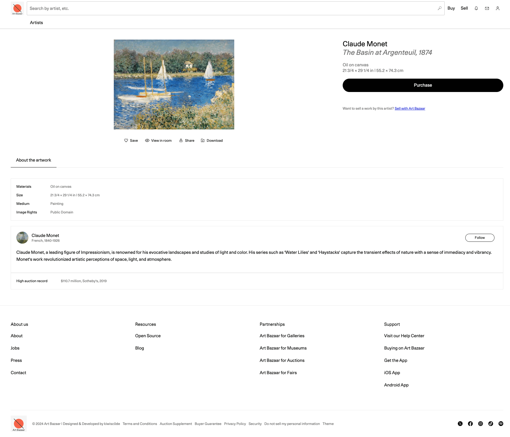
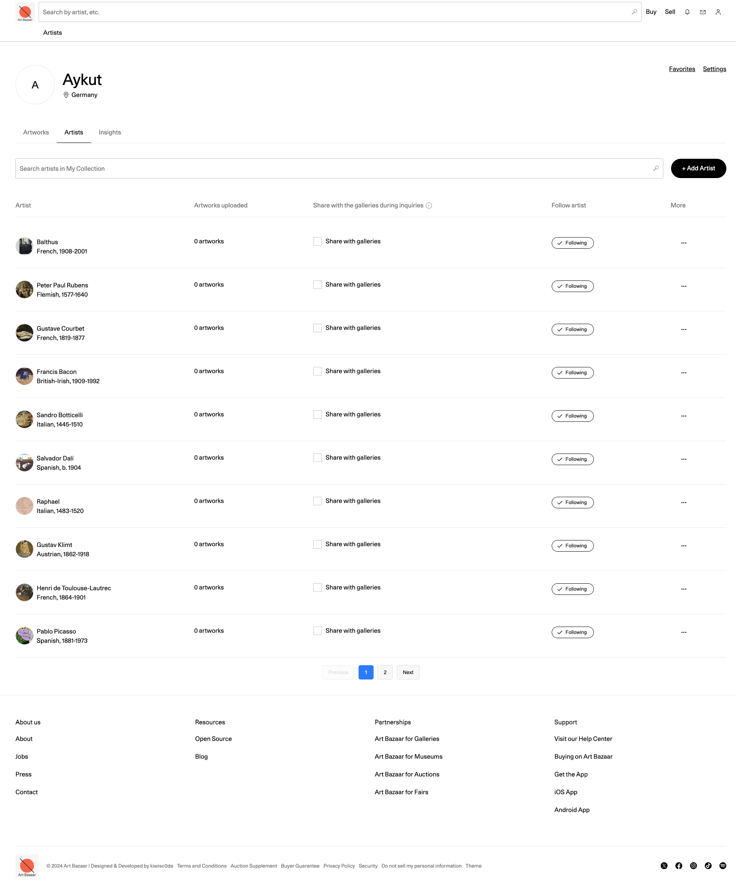
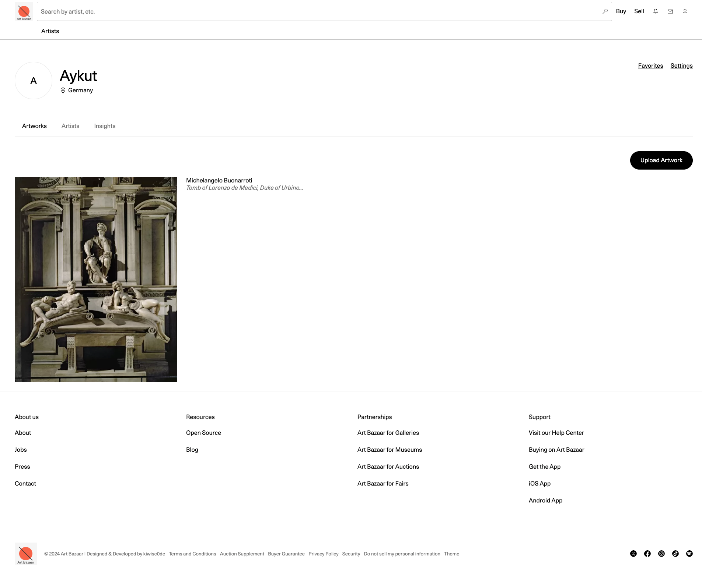
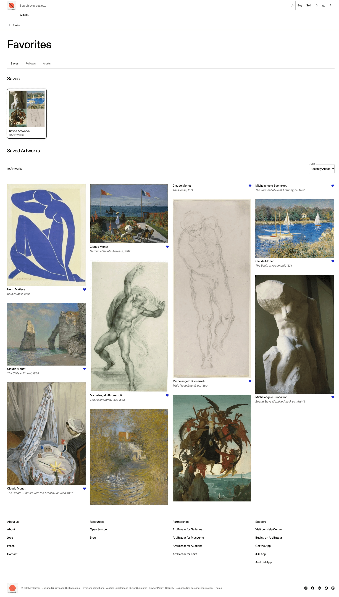
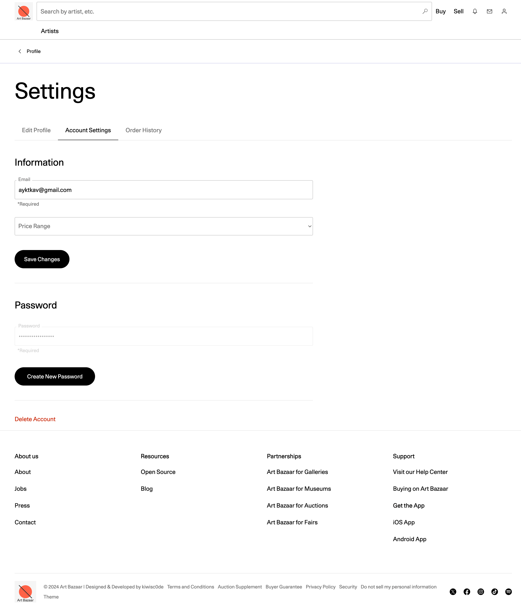

# 
<h1>Art Bazaar</h1>

**Art Bazaar** is an online marketplace where users can discover, buy, and manage unique artworks from various artists. The platform offers personalized art recommendations, detailed artist insights, and secure Stripe payment integration.

[🌐 Live Demo](https://art-bazaar.vercel.app) • [📂 Source Code](https://github.com/kiwiscode/art_bazaar)

---

## 🚀 Tech Stack

- React
- Material UI
- CSS
- Node.js
- Express
- MongoDB
- Mongoose ODM
- Cloudinary
- Stripe API
- Google OAuth2
- Handlebars
- Webhooks

---

## 🔑 Key Features

### 🔐 User Authentication

- Google OAuth2 login
- Email registration
- Password reset with a 24-hour expiration token

### 🧠 Personalized Content

- Custom API calls filtering content based on user preferences
- Tailored recommendations using user profile & interaction history

### 👤 Profile Management

- Edit name, location, profession, email & password
- Preference settings for artwork price range
- View and manage order history

### 🖼️ Artwork Management

- View, upload, edit, and delete owned artworks
- Share artworks with galleries

### 🛒 Artwork Purchase

- Browse artwork by price
- Secure Stripe integration for purchases
- Order history and invoice tracking

### 🎨 Artist & Collection Management

- Follow/unfollow artists
- See auction records, accolades, and exhibition history
- Organize artworks into private/public collections
- Get alerts for selected artists

### ❤️ Favorites & Alerts

- Favorite artworks
- Filter favorites (recently added, oldest, etc.)
- Alert system for followed artists

### 📊 Insights & Analytics

- Track total followed artists
- Track owned artworks

### 📚 Detailed Artist & Artwork Info

- Artist bio, origin, auction history, exhibition data
- Deep insights into individual artworks

### 🧼 Account Management

- Permanently delete account with confirmation and optional reason

### 📱 Responsive Design

- Fully responsive layout
- Optimized for mobile, tablet, and desktop devices

---

## 📸 Screenshots

### Home & Artwork Views

- 
- 

### Collector Profile

- 
- 

### Favorites & Settings

- 
- 
